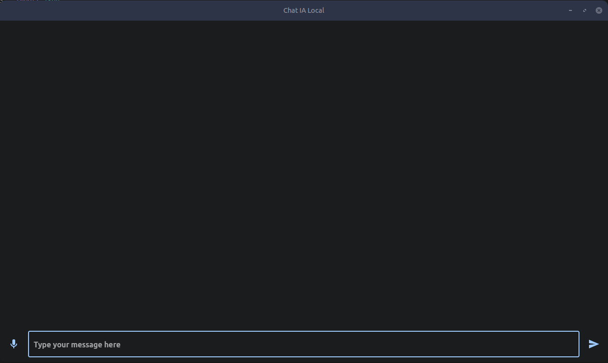

<div align="center" id="top"> 
  <h1>Simple chatbot using Ollama + Flet</h1>
</div>




## Instalation

| Model              | Parameters | Size  | Download                       |
| ------------------ | ---------- | ----- | ------------------------------ |
| Llama 2            | 7B         | 3.8GB | `ollama run llama2`            |
| Mistral            | 7B         | 4.1GB | `ollama run mistral`           |
| Dolphin Phi        | 2.7B       | 1.6GB | `ollama run dolphin-phi`       |
| Phi-2              | 2.7B       | 1.7GB | `ollama run phi`               |
| Neural Chat        | 7B         | 4.1GB | `ollama run neural-chat`       |
| Starling           | 7B         | 4.1GB | `ollama run starling-lm`       |
| Code Llama         | 7B         | 3.8GB | `ollama run codellama`         |
| Llama 2 Uncensored | 7B         | 3.8GB | `ollama run llama2-uncensored` |
| Llama 2 13B        | 13B        | 7.3GB | `ollama run llama2:13b`        |
| Llama 2 70B        | 70B        | 39GB  | `ollama run llama2:70b`        |
| Orca Mini          | 3B         | 1.9GB | `ollama run orca-mini`         |
| Vicuna             | 7B         | 3.8GB | `ollama run vicuna`            |
| LLaVA              | 7B         | 4.5GB | `ollama run llava`             |

> Note: You should have at least 8 GB of RAM available to run the 7B models, 16 GB to run the 13B models, and 32 GB to run the 33B models.

First, need to install ollama in our system (only posible on MacOS, Linux)
```bash
https://ollama.com/download
```

Later install the model
```bash
ollama run llama2
```

To run the project after install the model, it is necesary to have flet. To install flet, is needed to install a virtual enviroment, we have 2 forms, with venv or with anaconda.
```bash
pip install flet
```


